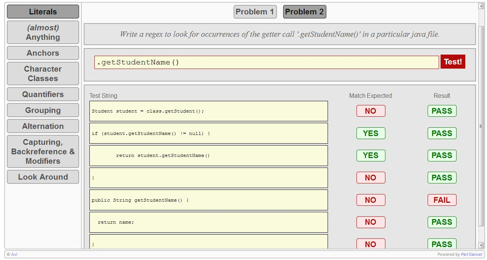

# regex-tutorial

A small tool to help learn basics regular expressions, with a test driven approach.



It was created as an instructional aid for a regular expression tutorial talk. 
It is written in Perl using the Dancer web application framework.

## Setup

* Clone the repo.
* In the project directory, run the following command to install `Dancer`.
```sh
$ perl -MCPAN -e "CPAN::Shell->notest('install', 'Dancer')"
```
* In case Dancer complains about not finding the `Tempate` module, run the below command to install `Template`.
```sh
$ perl -MCPAN -e "CPAN::Shell->notest('install', 'Template')"
```

## Run
* Run the following command from the project directory to run the web app.
```sh
$ ./bin/app.pl
```
* Once running, the application can be accessed at `localhost:3000`